# RBS Architecture

This document describes the system architecture, core components, key runtime flows, security boundaries, and extension points of the Global Trust Authority Resource Broker Service (RBS) workspace. It covers `rbs`, `rbc`, and `rbs-cli`, and helps maintainers and contributors understand responsibility boundaries, contract surfaces, and collaboration across the server, clients, and management tools.

## 1. Introduction

- **Goals**: Explain how the RBS workspace securely delivers keys, certificates, and other protected resources to trusted workloads through remote attestation, policy-based authorization, and controlled resource release.
- **Audience**: Maintainers and contributors; security reviewers should focus on trust boundaries, critical data flows, and the security architecture sections.
- **Scope**: The overall relationship among `rbs`, `rbc`, and `rbs-cli`, plus architectural boundaries among core crates, the REST API, storage, resource backends, and documentation contracts.
- **Non-goals**: This document does not replace installation guides, API references, the RBC usage guide, CLI manuals, or feature-specific design documents. Implementation details appear only when they affect architectural boundaries, compatibility, or security properties.

## 2. Architecture Goals and Constraints

- **Security goals**: Use remote attestation to appraise workload state and claims, use policy authorization to decide resource access, constrain admin APIs through role and action boundaries, and keep resource retrieval and response generation on an authorized processing path inside RBS after authorization succeeds.
- **Quality attributes**: Security, auditability, extensibility, testability, deployability, and API compatibility.
- **Standards terminology alignment**: RATS roles and RFC 9334 Passport / Background-Check attestation models — see §5.
- **Open-source constraints**: Mulan PSL v2 license, reproducible build/test commands, contributor-facing documentation, and clearly recorded compatibility rules.

## 3. System Context

### 3.1 Context Diagram

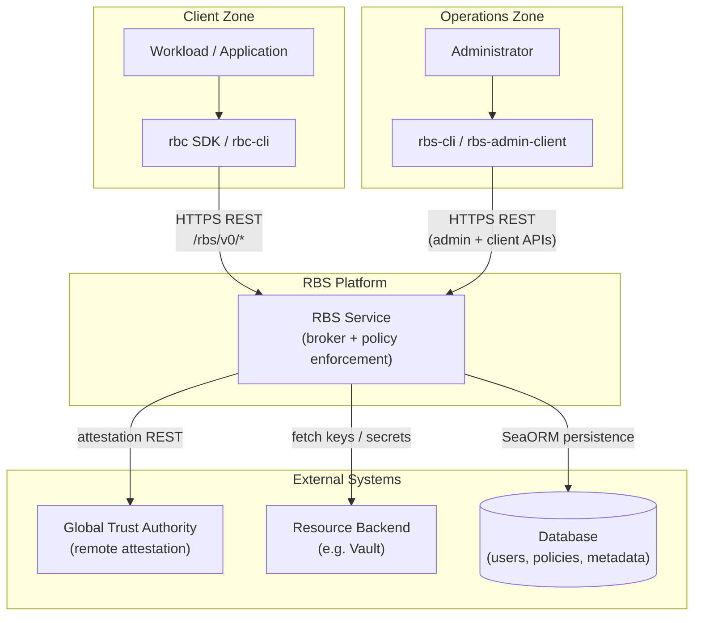

**Actors and systems shown:**

- Workloads or applications that consume RBS-protected resources.
- `rbc` SDK or `rbc-cli` as the client integration layer.
- RBS service as the resource broker and policy enforcement point.
- [Global Trust Authority](https://gitcode.com/openeuler/global-trust-authority) as the remote attestation authority; its repository hosts the GTA service, attestation components, and client-side attestation agent capabilities.
- Resource backends such as Vault.
- Database storing users, policies, resources, and metadata.
- Administrators using `rbs-admin-client` or operator tooling.

### 3.2 Trust Boundaries

Primary trust boundaries include:

- Client ↔ RBS network boundary.
- RBS ↔ GTA remote attestation boundary.
- RBS ↔ database persistence boundary.
- RBS ↔ resource backend secret boundary.
- Admin API boundary vs regular client API boundary.

## 4. Runtime Invocation

This document uses **RESTful mode** as the primary narrative: RBS runs as an independent HTTP/HTTPS service, and `rbc`, `rbc-cli`, `rbs-cli`, and management clients access it through the REST API. The built-in/library form of `rbs-core` is an embedded variant of the same core capabilities; this document explains its boundary impact without expanding client implementation details.

- **RESTful mode**: RBS runs as a standalone HTTP/HTTPS service process; clients access it through the REST API. This is the primary shape described in this document.
- **Built-in / library mode**: The host application links `rbs-core` directly and invokes core capabilities in-process, without the `rbs-rest` HTTP adaptation layer.

| Dimension | RESTful | built-in / library |
|-----------|---------|---------------------|
| Runtime shape | `rbs` runs as a standalone service process | Host application links `rbs-core` directly or embeds RBS capabilities |
| Entry boundary | `rbs-rest` exposes HTTP/HTTPS APIs; `rbc`, `rbc-cli`, and `rbs-cli` call over REST | No HTTP adaptation boundary; the host application owns invocation, auth, configuration, and lifecycle |
| Core responsibility | `rbs` wires configuration, logging, database, providers, REST server, and `RbsCore` | `rbs-core` reuses attestation, policy, resource, and admin capabilities; the host application owns assembly and runtime constraints |
| Applicability | Flow diagrams in this document default to this shape | This document explains core capability boundaries only and does not prescribe host network, process, or deployment shape |

- **Feature flags**: `rest`, `lib`, `per-ip-rate-limit`.
- **Configuration entry points**: `rbs/conf/rbs.yaml`, `RBS_CONFIG`, REST, TLS, logging, storage, attestation, auth, and resource backend configuration.

## 5. RATS Attestation Models ([RFC 9334](https://www.rfc-editor.org/rfc/rfc9334))

> **Terminology disambiguation:** *Passport* and *Background-Check* name [RFC 9334](https://www.rfc-editor.org/rfc/rfc9334) attestation interaction models only. They are **orthogonal** to runtime invocation shape (§4): they do not mean RESTful standalone service vs built-in/library deployment.

[RFC 9334](https://www.rfc-editor.org/rfc/rfc9334) defines RATS roles and the Passport / Background-Check attestation interaction models. This document uses those terms to describe the RBS attestation path, without claiming conformance to a specific wire format, EAT/CoRIM profile, or every optional RATS extension.

| RATS role | RBS mapping |
|------|------|
| Attester | Workload / `rbc` client |
| Verifier | GTA (via `GtaRestProvider`) or built-in attestation provider |
| Relying Party | RBS (resource broker and policy enforcement point) |

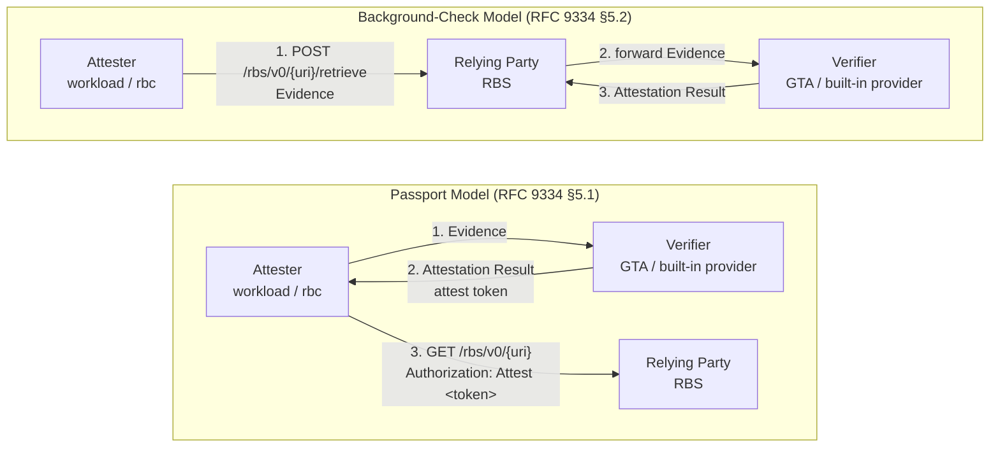

Both patterns can be used against the same RESTful RBS deployment. They describe **how evidence and attestation results flow**, not whether RBS runs as a standalone process or is linked as a library.

In **RESTful RBS**, Passport steps 1–2 are not direct client→GTA HTTP calls: the client obtains a challenge and submits evidence through RBS at `GET /rbs/v0/challenge` and `POST /rbs/v0/attest`; RBS forwards those operations to the configured attestation provider (typically GTA via `GtaRestProvider`).

## 6. Component Relationships and Dependency Boundaries

The workspace consists of server, client, and management tooling. This section explains component responsibilities, dependency direction, and how they collaborate through the REST API and shared contracts.

- `rbs/api-types`: Shared request/response types, configuration types, error payloads, constants, and OpenAPI schema definitions.
- `rbs/core`: Business logic for attestation, auth, policy, resource management, admin operations, logging, and database infrastructure.
- `rbs/rest`: Actix Web server, routes, middleware, rate limiting, error mapping, and OpenAPI document generation.
- `rbs`: Composition root — loads configuration, initializes logging and storage, builds `RbsCore`, bootstraps admin state, and starts the REST server.
- `rbc`: Client SDK, `rbc-cli`, evidence/token providers, FFI, and resource retrieval integration; architecturally the resource-access client for RBS.
- `tools` / `rbs-cli`: Management and operations entry points for users, resources, policies, tokens, and client-side verification workflows.

**Dependency direction:**

- `rbs-api-types` defines shared contracts and must not contain business logic.
- `rbs-core` owns business rules and must not depend on HTTP framework details.
- `rbs-rest` adapts HTTP requests to core services.
- `rbs` wires concrete configuration, infrastructure, and runtime entry points.
- `rbc`, `rbc-cli`, and `rbs-cli` align with RBS through the REST API or shared contracts and must not push business boundaries back into `rbs-core`.

### 6.1 Component Relationship Diagram

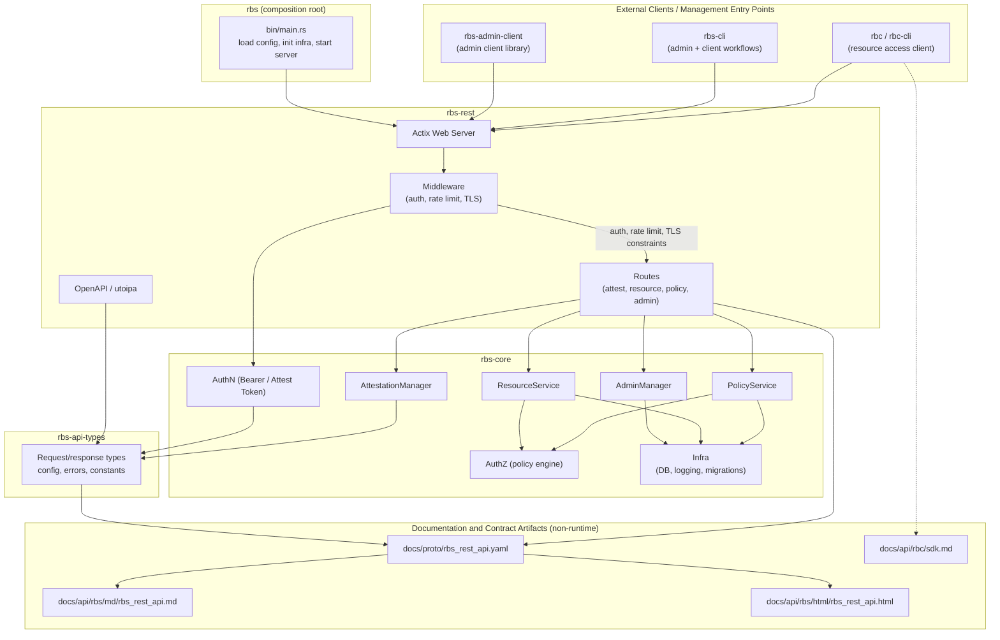

`rbs-rest` middleware wraps requests at the HTTP boundary: optional TLS termination, optional per-IP rate limiting, and **authentication on protected paths only**. Public paths skip middleware auth entirely (see §10). The `POST .../retrieve` handler performs inline attestation and token validation inside the route (middleware skipped for auth). Business dispatch remains in route handlers: routes adapt validated request bodies, path parameters, and auth context into `RbsCore` service calls, and core services such as `AttestationManager`, `PolicyService`, `ResourceService`, and `AdminManager` execute business rules. `Authenticator` (Bearer / Attest verification) is constructed per REST worker in `rbs-rest`; `RbsCoreBuilder` wires `AuthzChecker` / `AuthzFacade` and policy engine only.

## 7. Core Component Architecture

For crate-level roles and the component relationship diagram, see §6. This section focuses on how core managers collaborate inside `rbs-core`.

### 7.1 Core Module Relationships

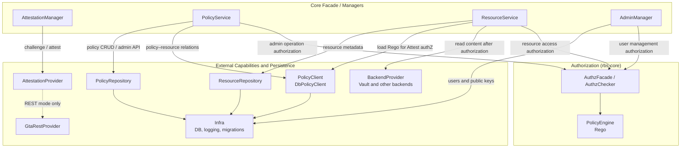

- **`PolicyService`** — admin policy CRUD and policy admin API operations (via `PolicyRepository`).
- **`PolicyClient`** — runtime read adapter for `ResourceService` and `PolicyService` relation checks (`get_policy_content`, `relation_res_ids`); `DbPolicyClient` reads policy and resource rows through SeaORM directly.
- **Token authentication** — `Authenticator` runs in `rbs-rest` middleware (not `RbsCoreBuilder`). Validated `AuthContext` is passed into core services; `AttestationManager` does not call `Authenticator`.
- **GTA edge** — `GtaRestProvider` forwards challenge and evidence only. Attest tokens on resource `GET` are verified locally (JWKS / `auth.attest_token`); they are not sent back to GTA per request. `BuiltinAttestationProvider` is a `NotImplemented` stub (library mode).

## 8. Key Runtime Flows

### 8.1 Service Startup

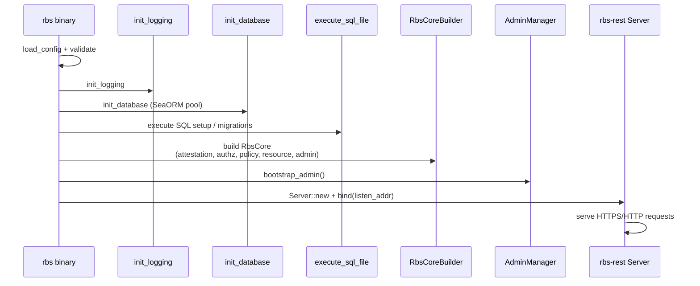

### 8.2 Challenge and Remote Attestation

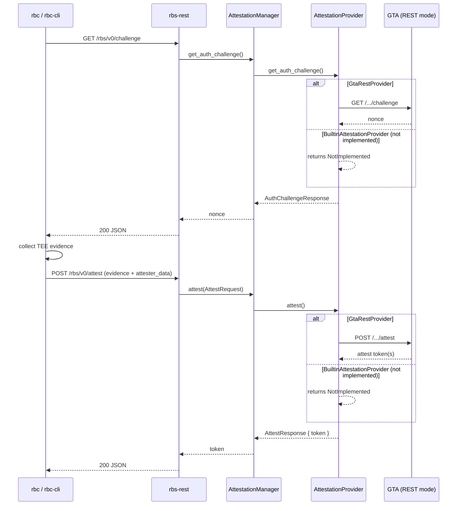

HTTP route handler `get_challenge` (`rbs/rest/src/routes/attestation.rs`) delegates to `AttestationManager::get_auth_challenge()` / `AttestationProvider::get_auth_challenge()` in core.

### 8.3 Resource Retrieval (Attest Token Path)

```mermaid
sequenceDiagram
    participant Client as rbc Session
    participant REST as rbs-rest
    participant Auth as auth middleware
    participant RS as ResourceService
    participant AuthZ as AuthzChecker
    participant DB as ResourceRepository
    participant PC as PolicyClient
    participant Backend as resource backend

    Client->>REST: GET /rbs/v0/{uri}<br/>Authorization: Attest &lt;attest-token&gt;
    REST->>Auth: validate Attest token and extract AuthContext
    Auth-->>REST: claims + TEE pubkey
    REST->>RS: get_content(ctx, uri)
    RS->>RS: validate URI
    RS->>DB: find_by_uri(uri)
    DB-->>RS: resource metadata
    RS->>PC: get_policy_content(policy_id)
    PC-->>RS: Rego policy
    RS->>AuthZ: check_resource_get(ctx, owner, rego)
    AuthZ->>AuthZ: evaluate attest claims against policy
    AuthZ-->>RS: allow
    RS->>Backend: get_resource_content(uri)
    Backend-->>RS: raw key / secret material
    RS->>RS: JWE encrypt with TEE pubkey from token
    RS-->>REST: ResourceContentResponse (base64 JWE)
    REST-->>Client: 200 JSON
    Client->>Client: decrypt_content(JWE, ephemeral key)
```

Passport `get_content` (Attest GET) reads the TEE encryption pubkey from **nested** claims only: `attester_data.runtime_data.tee-pubkey`. Top-level `tee-pubkey` is **not** accepted on this path.

### 8.3b Resource Retrieval (Bearer Owner GET Path)

Operational path for resource owners using `rbs-cli` or other operator tooling — **not** a RATS Passport flow. Middleware validates a Bearer JWT; authorization uses embedded `admin_policy.rego` (owner / `UserScoped` check), **not** the resource-bound Rego policy (which is used only on the Attest path).

```mermaid
sequenceDiagram
    participant Client as rbs-cli / operator
    participant REST as rbs-rest
    participant Auth as auth middleware
    participant RS as ResourceService
    participant AuthZ as AuthzChecker
    participant DB as ResourceRepository
    participant Backend as resource backend

    Client->>REST: GET /rbs/v0/{uri}<br/>Authorization: Bearer &lt;bearer-jwt&gt;
    REST->>Auth: validate Bearer JWT (iss, aud, exp, sub, per-user key; role extracted)
    Auth-->>REST: Bearer context (enc_pubkey claim)
    REST->>RS: get_content(ctx, uri)
    RS->>DB: find_by_uri(uri)
    DB-->>RS: resource metadata
    RS->>AuthZ: check_resource_get(ctx, owner, admin_policy.rego)
    AuthZ->>AuthZ: evaluate owner / UserScoped via admin_policy.rego
    AuthZ-->>RS: allow
    RS->>Backend: get_resource_content(uri)
    Backend-->>RS: raw key / secret material
    RS->>RS: JWE encrypt with enc_pubkey from Bearer claims
    RS-->>REST: ResourceContentResponse (base64 JWE)
    REST-->>Client: 200 JSON
```

The same Bearer + `admin_policy.rego` pattern applies to `GET /rbs/v0/{uri}/info` (metadata only, no backend fetch). `UserScoped` owner checks match `sub` to resource owner only — **`role` is not enforced** on this path (see §10 token matrix).

### 8.4 Resource Retrieval (Inline Evidence Path)

```mermaid
sequenceDiagram
    participant Client as rbc Session
    participant REST as rbs-rest
    participant AM as AttestationManager
    participant Provider as AttestationProvider
    participant GTA as GTA (REST mode)
    participant Auth as Authenticator (route handler)
    participant RS as ResourceService
    participant AuthZ as AuthzChecker
    participant PC as PolicyClient
    participant DB as ResourceRepository
    participant Backend as resource backend

    Client->>REST: POST /rbs/v0/{uri}/retrieve<br/>(AttestRequest body; no Authorization header)
    Note over REST: middleware skips auth for /retrieve
    REST->>AM: attest(inline evidence)
    AM->>Provider: attest()
    alt GtaRestProvider
        Provider->>GTA: POST /.../attest
        GTA-->>Provider: attest token
    else BuiltinAttestationProvider (not implemented)
        Provider-->>Provider: returns NotImplemented
    end
    Provider-->>AM: AttestResponse { token }
    AM-->>REST: token (internal only)
    REST->>Auth: validate attest token locally
    Auth-->>REST: claims + TEE pubkey
    REST->>RS: retrieve(ctx, uri)
    RS->>DB: find_by_uri(uri)
    DB-->>RS: resource metadata
    RS->>PC: get_policy_content(policy_id)
    PC-->>RS: resource-bound Rego
    RS->>AuthZ: check_resource_get (attest claims vs Rego)
    AuthZ-->>RS: allow
    RS->>Backend: get_resource_content(uri)
    Backend-->>RS: raw content
    RS->>RS: JWE encrypt
    RS-->>REST: ResourceContentResponse
    REST-->>Client: 200 JSON (JWE only; no attest token returned)
    Note over Client,REST: attestation backend failure → 502
```

Background-Check `retrieve` accepts the TEE encryption pubkey from nested `attester_data.runtime_data.tee-pubkey` **or** top-level `tee-pubkey` in attest token claims (Passport GET accepts nested only — §8.3).

### 8.5 Policy Lifecycle (Authenticated User, Bearer)

```mermaid
sequenceDiagram
    participant User as rbs-cli (authenticated user)
    participant REST as rbs-rest
    participant Auth as auth middleware
    participant PS as PolicyService
    participant AuthZ as AuthzFacade
    participant Repo as PolicyRepository

    User->>REST: POST /rbs/v0/resource/policy<br/>Authorization: Bearer &lt;bearer-jwt&gt;
    REST->>Auth: validate Bearer JWT + role
    Auth-->>REST: user context (admin or user role)
    REST->>PS: create(ctx, request)
    PS->>AuthZ: check admin/user permission (UserScoped or AdminOnly)
    PS->>PS: PolicyValidator
    PS->>Repo: persist policy
    Repo-->>PS: policy_id
    PS-->>REST: PolicyResponse
    REST-->>User: 201 JSON
```

Policy list, get, update, delete, and batch delete (`DELETE /rbs/v0/resource/policy?ids=...`) follow the same Bearer + `AuthzFacade` pattern. `AdminOnly` actions (for example `POST /rbs/v0/users`) require an administrator role; policy CRUD uses `UserScoped` or `AdminOnly` depending on the action — distinct from the operator Bearer owner GET path in §8.3b.

### 8.6 User and Administrator Lifecycle

```mermaid
sequenceDiagram
    participant Main as rbs binary
    participant AdminM as AdminManager
    participant Admin as rbs-cli (admin)
    participant REST as rbs-rest
    participant Auth as auth / authorization
    participant Repo as user repository

    Main->>AdminM: bootstrap_admin()
    AdminM->>Repo: check whether users exist
    alt no users
        AdminM->>Repo: create preconfigured administrator
    else users exist
        AdminM-->>Main: skip bootstrap
    end

    Admin->>REST: POST /rbs/v0/users<br/>Authorization: Bearer &lt;bearer-jwt&gt;
    REST->>Auth: validate administrator identity and permission
    Auth-->>REST: allow
    REST->>AdminM: create_user(request)
    AdminM->>Repo: persist user, public key, and role
    Repo-->>AdminM: user record
    AdminM-->>REST: UserResponse
    REST-->>Admin: 201 JSON

    Admin->>REST: GET /rbs/v0/users/{username}
    REST->>Auth: validate admin or self access
    REST->>AdminM: get_user(username)
    AdminM->>Repo: load user and public key
    Repo-->>AdminM: user record
    AdminM-->>REST: UserResponse
    REST-->>Admin: 200 JSON
```

The administrator lifecycle begins with `bootstrap_admin()` at service startup. If no users exist in the database, RBS creates the initial administrator from configuration; if users already exist, bootstrap is skipped to avoid overwriting existing admin state. Subsequent user create, read, update, and delete operations enter `AdminManager` through REST admin APIs and access the user repository after authentication, role authorization, and lockout checks.

### 8.7 External Client Resource Access Summary

```mermaid
sequenceDiagram
    participant App as Application
    participant SDK as rbc Client / Session
    participant EP as EvidenceProvider
    participant TP as TokenProvider
    participant REST as RBS REST API

    App->>SDK: Client::new(Config)
    App->>SDK: Session::new(attester_data)
    SDK->>REST: GET /rbs/v0/challenge
    REST-->>SDK: nonce
    SDK->>EP: collect_evidence(challenge)
    EP-->>SDK: evidence JSON
    SDK->>TP: get_token(evidence)
    TP->>REST: POST /rbs/v0/attest
    REST-->>TP: attest token
    TP-->>SDK: token
    SDK->>REST: GET /rbs/v0/{uri}<br/>Authorization: Attest &lt;attest-token&gt;
    REST-->>SDK: JWE-encrypted content
    SDK->>SDK: decrypt_content(JWE, ephemeral key)
    SDK-->>App: Resource (plaintext, zeroized on Drop)
```

This flow summarizes the **Passport Model** client path (§8.2 → §8.3). For the **Background-Check Model**, clients call `POST /rbs/v0/{uri}/retrieve` with inline evidence instead of a prior attest token (§8.4). Operators may retrieve owned resources with Bearer JWT and `admin_policy.rego` (§8.3b) without a TEE attestation flow.

## 9. Data and Persistence Architecture

RBS stores operational metadata in the database and protected resource content in external backends. SeaORM abstracts SQLite, PostgreSQL, and MySQL; **production bootstrap is SQLite-centric today**.

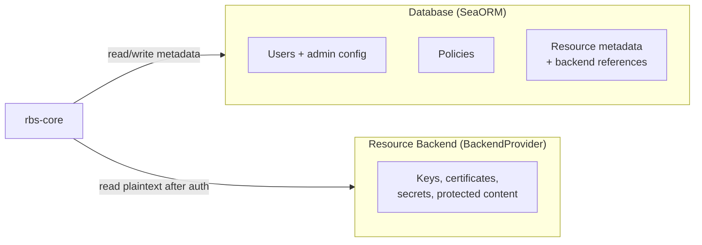

| In database | Not in database |
|-------------|-----------------|
| Users, roles, lockout state | Protected resource content (keys, certs, secrets) |
| Policies (Rego) | Vault tokens / backend credentials (config-held only) |
| Resource metadata + backend references | Attestation evidence as primary DB data |
| Admin configuration | — |

| Concern | Details |
|---------|---------|
| **Bootstrap** | Config → connection → `migrate_core_tables()` (`infra/rdb/connection.rs`) applies `sql_file_path` (default `rbs/rdb_sql/sqlite_rbs.sql`) |
| **Other engines** | PostgreSQL/MySQL configurable; `mysql_rbs.sql` is a stub — operators supply schema/migration (not default path) |
| **Contract sync** | `rbs-api-types` ↔ OpenAPI YAML ↔ Markdown/HTML API docs |
| **Sensitive data** | Config fields, Vault tokens, protected content; `zeroize` where applicable |

## 10. Security Architecture

RBS enforces **default deny** on Bearer JWT and Attest token paths (action/owner + Rego; Bearer `role` enforced only on `AdminOnly` via `admin_policy.rego`). Transport, rate limiting, and trusted-proxy behavior are config-dependent.

### Threat model

| Actor / risk | Surface |
|--------------|---------|
| Unauthenticated clients | Public routes below; `POST /rbs/v0/{uri}/retrieve` uses handler-level inline attestation |
| Forged attestation evidence | GTA verification (built-in provider is `NotImplemented` stub) |
| Token replay within TTL | Bearer: no `jti` tracking; Attest: reusable within `exp` |
| Credential leakage | Logs/errors must not emit full tokens; backend creds protected |
| Unauthorized administrators | Bearer + `admin_policy.rego` / role checks |
| Backend leakage | Plaintext only after auth; JWE before client response |
| Network attackers | HTTPS when `rest.https.enabled`; trusted proxy for client IP |
| DoS / abuse | Unauthenticated `GET .../challenge`, `POST .../attest`, and `POST .../retrieve` (inline attest fan-out to GTA) — mitigate via `per-ip-rate-limit` + runtime rate limit config |
| Remote attestation trust chain | GTA REST provider (default), built-in stub, provider selection, trust assumptions |

### Authentication dual-path

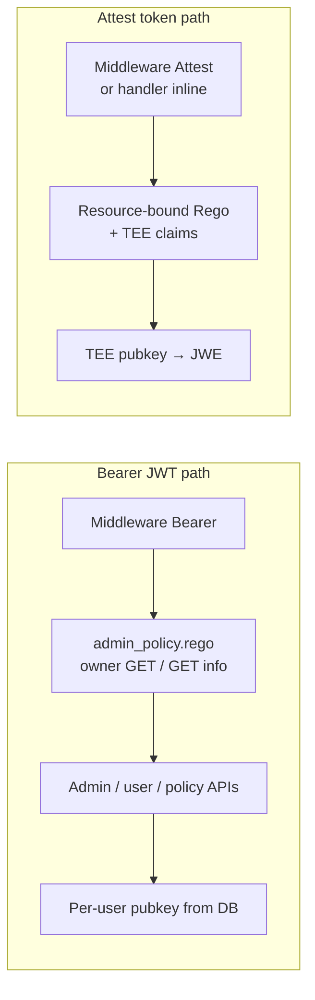

### Route authentication

| Path / route class | Auth |
|--------------------|------|
| `GET /rbs/v0/challenge` | Public — forwards to attestation provider (GTA) |
| `POST /rbs/v0/attest` | Public — forwards evidence to attestation provider |
| `GET /rbs/version` | Public |
| `POST /rbs/v0/{uri}/retrieve` | Public middleware; handler inline attestation; ignores `Authorization` |
| Resource `GET` / `GET .../info` | **Attest** or **Bearer** |
| Policy, user, resource CRUD (non-GET) | **Bearer** only |
| All other routes | Middleware auth (Bearer and/or Attest per path) |

### Token validation matrix

| | Bearer JWT | Attest token |
|---|------------|--------------|
| **Used for** | Admin/user/policy APIs; owner-only resource GET/GET info (`admin_policy.rego`, not resource-bound Rego) | Resource GET (Passport); after `POST .../retrieve` (Background-Check) |
| **Enforced at authn** | `iss`, `aud`, `exp`, `sub`, signature vs per-user pubkey (DB); `role` extracted but not required for all Bearer paths | Signature, `exp`, `iss`; `aud` only when `auth.attest_token.audience` configured |
| **Enforced at authz (Bearer)** | `role == admin` only for `AdminOnly` (`admin_policy.rego`); owner GET/info (`UserScoped`) checks `sub` vs owner — no `role` requirement | — |
| **Not enforced** | `scope`, `jti` / one-time-use store | `jti` / one-time-use store |
| **Replay** | RBS does not track Bearer replay | Reusable within `exp`; do not conflate with challenge-nonce freshness (GTA) |
| **Lockout** | Failed verifications for existing user increment lockout; attest failures excluded | — |
| **Logging** | Full tokens must not appear in logs, errors, or audit events | Same |

### Security invariants

| # | Invariant |
|---|-----------|
| 1 | **Nonce control:** Challenge nonces forwarded to attestation provider (typically GTA REST); `rbs-core` has no local single-use nonce store — freshness enforced by GTA |
| 2 | **Default deny:** Missing policy, invalid Rego, missing claims, expired tokens, locked users, `AdminOnly` role mismatch, missing metadata, or unresolvable backend ref → reject |
| 3 | **Plaintext boundary:** Resource plaintext enters `rbs-core` only after authorization on a controlled path; JWE-encrypt ASAP; no logging of evidence, tokens, backend creds, or plaintext |
| 4 | **`export_mode`:** Metadata on resource records only; release always JWE today; `plain` rejected at validation |

### Configuration-dependent controls

| Control | Mechanism |
|---------|-----------|
| **Transport** | HTTPS when `rest.https.enabled` (OpenSSL cert/key); plain HTTP valid for dev |
| **Trusted proxy** | `rest.trusted_proxy.addrs` for client IP behind reverse proxies |
| **Rate limiting** | Compile-time `per-ip-rate-limit` + runtime `rest.rate_limit.enabled`, `requests_per_sec`, `burst` |
| **Secret handling** | No sensitive log output; protect backend credentials; restrict protected resource exposure |
| **Auditability** | Logging: startup, admin ops, auth failures, policy/resource decisions, backend errors |

### 10.1 Security Boundaries and Data Flow

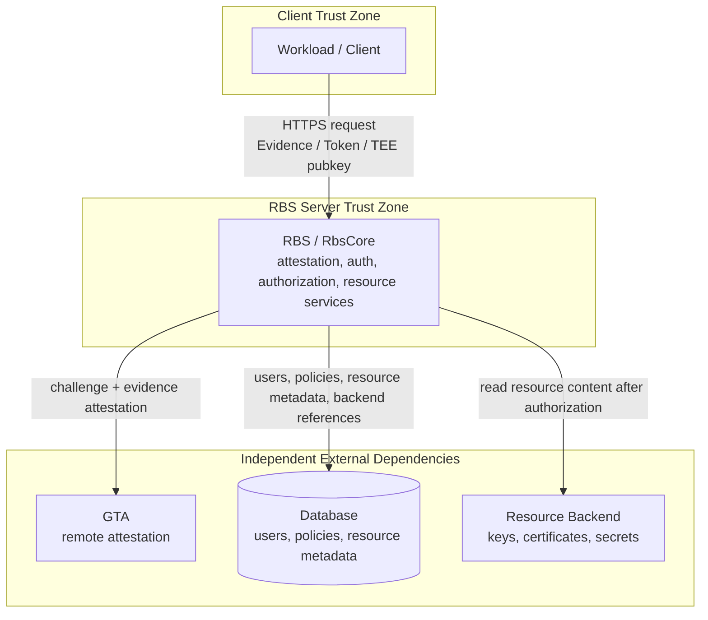

Attest tokens on resource `GET` are verified **locally** in RBS (JWKS or configured public key), not per-request to GTA. GTA, database, and resource backend are independent — no `GTA → database → resource backend` chain.

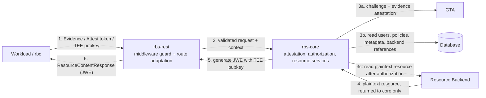

Evidence, credentials, policy, metadata, and plaintext occupy separate boundaries. Plaintext enters RBS only after authorization, is JWE-encrypted in `rbs-core`, and returns as `ResourceContentResponse` (DB vs backend: §9).

## 11. API and Compatibility

RBS exposes versioned REST under `/rbs/v0` and system metadata at `/rbs/version`. Judge client compatibility against the REST contract, `api_version`, and `build` metadata — not Cargo binary version alone.

### Route registration order

Fixed `/rbs/v0` routes register **before** wildcard resource routes in `rbs/rest/src/routes/mod.rs` to prevent URI collisions. `GET /rbs/version` mounts on the `/rbs` scope in `rbs/rest/src/server/http.rs` (not under `v0`).

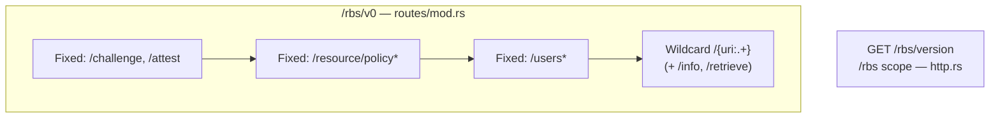

### Path taxonomy

| Class | Mount | Paths | Actix pattern | Validation |
|-------|-------|-------|---------------|------------|
| **Fixed v0** | `routes/mod.rs` under `/rbs/v0` | `/challenge`, `/attest`, `/resource/policy[/{policy_id}]`, `/users[/{username}]` | Exact routes | — |
| **Wildcard v0** | Same file, **last** | `/rbs/v0/{res_provider}/{repository_name}/{resource_type}/{resource_name}` (+ `GET .../info`, `POST .../retrieve`, CRUD) | `/{uri:.+}` | Four-segment shape enforced in `rbs/core`; reserved `res_provider` values (`admin`, `attestation`, `resource`, `health`) rejected to avoid shadowing system paths |
| **Version** | `server/http.rs` on `/rbs` | `GET /rbs/version` | Exact route | Not under `v0` |

### Authentication by route class

Full token matrix: [§10](#10-security-architecture). Summary:

| Route class | Auth | Notes |
|-------------|------|-------|
| `GET /rbs/version` | None | — |
| `/challenge`, `/attest` | Public middleware | Forwards to attestation provider (GTA) |
| `POST .../retrieve` | Public middleware; handler inline | Inline evidence validation and token parsing; ignores `Authorization` header |
| Resource `GET` / `GET .../info` | **Attest** or **Bearer** | — |
| Resource POST/PUT/DELETE, users, policies | **Bearer** only | — |

### API version vs build version

| Field | Source | Meaning |
|-------|--------|---------|
| `api_version` | `API_VERSION` const (currently `"0"`) | REST **contract** version |
| `build.version` | `CARGO_PKG_VERSION` | Cargo **binary** release version (semver) |
| `service_name` | `SERVICE_NAME` | Logical service identity (`globaltrustauthority-rbs`) |
| `build.git_hash` | Build-time embed | Git commit hex, or empty when not embedded |
| `build.build_date` | Build-time embed | UTC build timestamp, or empty when not embedded |

All appear in `GET /rbs/version` → `RbsVersion` JSON (`BuildMetadata` nested under `build`).

### OpenAPI lifecycle

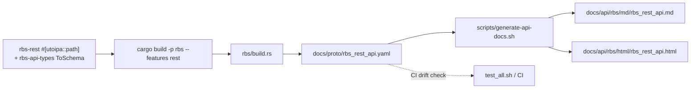

`rbs-rest` route annotations and `rbs-api-types` schemas form the REST contract source.

### Client contract boundaries

| Client surface | Contract | Notes |
|----------------|----------|-------|
| `rbc`, `rbc-cli`, `rbs-cli client`, CLI/FFI entry points | RBS OpenAPI / REST | Must stay aligned with REST contract |
| `rbs-cli admin` user / resource-policy | RBS REST paths | — |
| `rbs-cli admin` cert / policy / ref-value | GTA REST (`/rbs/v0/attestation/...`) | **Not** RBS server OpenAPI |
| [`docs/api/rbc/sdk.md`](../api/rbc/sdk.md) | Client SDK reference | Does not define the RBS server API |

### Error model

| Aspect | Behavior |
|--------|----------|
| Response shape | `ErrorBody { error: string }` |
| `RbsError::StableCode` | Internal HTTP-status mapping; not serialized in responses by default |
| Admin / attestation routes | `external_message()` |
| Resource routes | Some errors return `Display` text |
| Internal causes | Logged separately from client-facing `error` string |

**Backward compatibility:** Prefer additive request/response changes, optional configuration fields with defaults, and documented breaking changes.

## 12. Observability and Operations

Operational surfaces: structured logging, version metadata (§11), compile-time features, runtime config, and layered test gates. RPM, container, and install steps: [`docs/build/build_and_install.md`](../build/build_and_install.md), [`docs/build/rpm.md`](../build/rpm.md).

### Logging stack

| Layer | Location / mechanism | Notes |
|-------|---------------------|-------|
| Facade | `log` crate | `error!` / `warn!` / `info!` / `debug!` / `trace!` |
| Custom logger | `rbs/core/src/infra/logging/` | File target; optional rotation and gzip via `flate2` |
| Configuration | `logging.*` in [`rbs/conf/rbs.yaml`](../../rbs/conf/rbs.yaml) | `level`, `format` (text/json), `file_path`, `enable_rotation`, `rotation.*` |
| Flush | Tests and shutdown only | `log::logger().flush()` — not on per-request hot paths |

### Version metadata

Same fields and endpoint as [§11](#11-api-and-compatibility) (`GET /rbs/version`, no auth).

### Build features vs external docs

| Feature / topic | Architecture role | Detailed install / RPM |
|-----------------|-------------------|------------------------|
| `rest` (default) | HTTP server binary | [`docs/build/build_and_install.md`](../build/build_and_install.md) |
| `per-ip-rate-limit` | Compile-time rate-limit middleware | Same + [`docs/build/rpm.md`](../build/rpm.md) |
| `lib` | Library-only binary (no HTTP) | `build_and_install.md` |
| Runtime TLS, rate limit, proxy | `rest.*` in config | §10 configuration-dependent controls |

### Configuration operations

| Area | Config keys (sample) | Purpose |
|------|---------------------|---------|
| TLS | `rest.https.enabled`, `cert_file`, `key_file` | OpenSSL HTTPS (see sample [`rbs.yaml`](../../rbs/conf/rbs.yaml)) |
| Database | `storage.*`, `sql_file_path` | SQLite default; PostgreSQL/MySQL optional (§9) |
| Admin bootstrap | `admin.max_users`, `admin.admin_key.*` | Default admin pubkey; user cap |
| Attestation backend | `attestation.backends.*` | GTA REST provider (default) |
| Resource backends | Resource backend blocks in config | Vault and other `BackendProvider` adapters |
| Logging | `logging.*` | Level, format, rotation, gzip compression |

### Test strategy

| Gate | Command | Notes |
|------|---------|-------|
| Unit / integration | `cargo test --workspace` | Per-crate tests |
| Merge-readiness | `./tests/test_all.sh` | `pip install -r tests/requirements.txt` first; Cargo + OpenAPI drift + pytest e2e |
| E2e / filters | `./tests/run_e2e.sh`, `tests/e2e/` | Skip flags, suite markers: [`tests/README.md`](../../tests/README.md) |

## 13. Extension Points

Extensions follow dependency direction: `rbs-api-types` (contracts) → `rbs-core` (rules) → `rbs-rest` (HTTP) → binary or host assembly (§6). All async provider traits require `Send + Sync`.

### Core traits and adapters

| Extension | Location | Purpose |
|-----------|----------|---------|
| `AttestationProvider` | `rbs/core/src/attestation/provider.rs` | Challenge + evidence → attest token (GTA REST default; `BuiltinAttestationProvider` stub) |
| `ResourceBackend` | `rbs/core/src/resource/adapter/mod.rs` | Read protected content after authorization |
| `BackendProvider` | same | Registry: `res_provider` → `Arc<dyn ResourceBackend>` |
| `PolicyClient` / `DbPolicyClient` | same | Runtime policy reads for `ResourceService` (validation + content) |
| `UserKeyProvider` | `rbs/core/src/auth/authn/mod.rs` | Bearer JWT pubkey lookup (`AdminManager` impl) |
| `VaultBackend` | `rbs/core/src/resource/adapter/vault.rs` | Reference Vault `ResourceBackend` adapter |

### Other extension surfaces

| Surface | Location | Notes |
|---------|----------|-------|
| REST routes | `rbs/rest/src/routes/` | `#[utoipa::path]` + OpenAPI pipeline (§11); auth per §10 |
| Admin operations | `rbs/core/src/admin/` | Bearer + role checks |
| Client / tooling | `rbc/`, `rbc-cli/`, `tools/rbs-cli/` | Must match REST contract; attestation admin commands use GTA API |

### REST vs built-in wiring

Deployment comparison: §4. Built-in mode omits HTTP/middleware; host must supply a real `AttestationProvider` (default built-in stub returns `NotImplemented`).

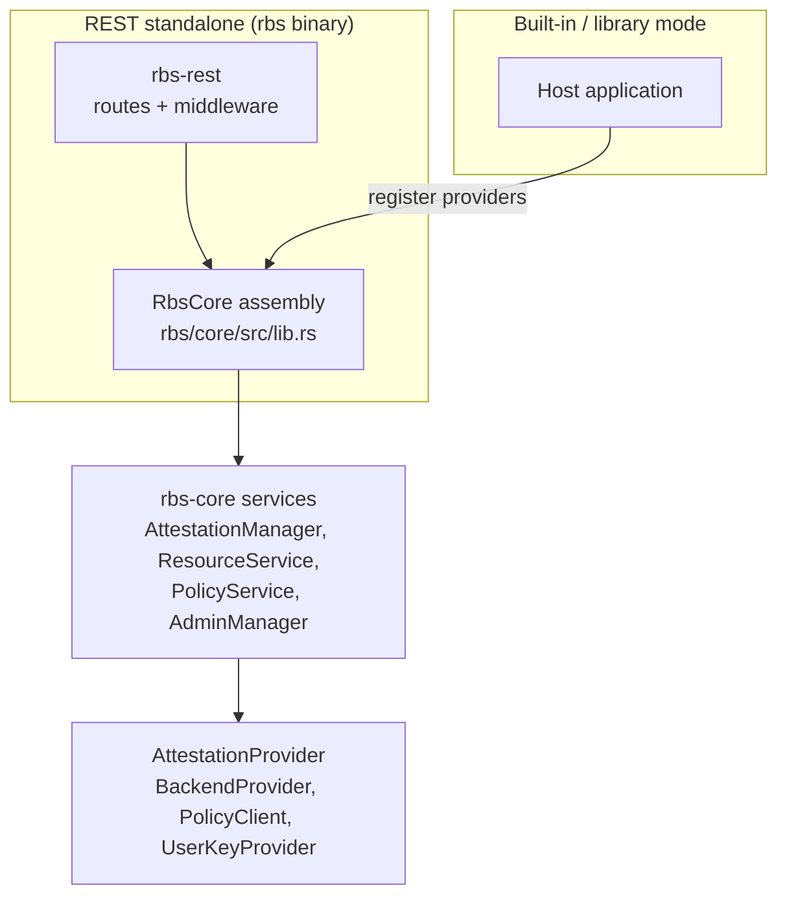

### Extension checklist

| Step | Requirement |
|------|-------------|
| Contract | Owning crate, public trait/API, test location |
| Tests | Failure-path coverage; no leakage of evidence, tokens, keys, or plaintext |
| REST changes | Route annotations + `./scripts/generate-api-docs.sh` (§11) |
| Security | Review against §10 when auth boundaries change |

## 14. Development and Contribution Notes

Contributor workflows follow crate boundaries (§6). Commands: [`AGENTS.md`](../../AGENTS.md); test layout: [`tests/README.md`](../../tests/README.md). Logging, TLS, rate limits, and config keys: §12.

### Build, test, and docs

| Task | Command / output |
|------|-------------------|
| Core library | `cargo build -p rbs-core` |
| REST binary (default) | `cargo build -p rbs` |
| Library-only binary | `cargo build -p rbs --no-default-features --features lib` |
| Workspace / release | `cargo build --workspace`; `cargo build --release --workspace`; RPM: `./scripts/build-rpm.sh` |
| Tests | `cargo test --workspace`; merge gate `./tests/test_all.sh`; e2e-only `./tests/run_e2e.sh` |
| API doc regen | `./scripts/generate-api-docs.sh` → `docs/proto/rbs_rest_api.yaml`, `docs/api/rbs/md/`, `docs/api/rbs/html/` |

### Contribution rules

| Topic | Rule |
|-------|------|
| Crate layout | Logic `rbs-core`; HTTP `rbs-rest`; types `rbs-api-types` |
| Traits | `Send + Sync` on async provider traits |
| API changes | `#[utoipa::path]` + `ToSchema`; regen docs; CI fails on OpenAPI drift |
| Security changes | Update §10; test failure paths; never log secrets |

### Documentation map

| Document | Role |
|----------|------|
| [`README.md`](../../README.md) | Entry point |
| [`docs/usage_guide/rbc.md`](../usage_guide/rbc.md), [`rbs_cli.md`](../usage_guide/rbs_cli.md) | Task-flow guides |
| `docs/api/rbs/` | REST endpoint reference (generated) |
| [`docs/api/rbc/sdk.md`](../api/rbc/sdk.md) | Client SDK reference |
| This document | System structure and boundaries |

## 15. Key Architectural Decisions

The following decisions are recorded in this document. See cross-references in earlier sections when boundaries or contracts change.

| ID | Title | Status | Decision (one line) |
|----|-------|--------|---------------------|
| — | RESTful service vs built-in library | Documented (§4) | Standalone HTTP via `rbs-rest` binary, or embed `rbs-core` in-process without HTTP |
| — | Provider pattern (attestation + resource) | Accepted | `AttestationProvider` + `BackendProvider`/`ResourceBackend` registries; config-driven wiring |
| — | SeaORM multi-database persistence | Accepted | SeaORM repositories; SQLite default bootstrap; PostgreSQL/MySQL operator-supplied |
| — | OpenAPI as REST contract source | Accepted | `utoipa` annotations + `build.rs` YAML; CI drift check in `test_all.sh` |
| — | Vault resource backend adapter | Accepted | `VaultBackend` implements `ResourceBackend`; tokens config-held only |
| — | Policy engine integration boundary | Accepted | Rego via `PolicyClient`; authorization in `rbs-core` before backend read; admin vs resource policies split |

## 16. Glossary

| Term | Meaning |
|------|---------|
| RBS | Resource Broker Service |
| RBC | Resource Broker Client |
| GTA | [Global Trust Authority](https://gitcode.com/openeuler/global-trust-authority), the remote attestation service |
| Attester | RATS role: the entity that produces Evidence; in RBS, the workload or `rbc` client |
| Relying Party | RATS role: the entity that uses attestation results to authorize access; in RBS, the broker service |
| Verifier | RATS role: the entity that appraises Evidence; in RBS, GTA (via `GtaRestProvider`) or the built-in attestation provider |
| Attestation Result | RATS term: verifier output consumed for authorization; in RBS, commonly an attest token |
| Attestation | Process of verifying workload trust evidence |
| Evidence | Claims and measurements submitted for attestation |
| Resource | Protected content such as keys, certificates, or secrets |
| Policy | Authorization rule controlling who may access a resource |
| Provider | Pluggable implementation behind a core trait |
| Resource Backend | External system that stores protected resource content, such as Vault or another `BackendProvider` adapter |
| External Dependency | System that RBS interacts with independently, including GTA, the database, and resource backends; do not use the overloaded term Backend |
| Passport Model | [RFC 9334](https://www.rfc-editor.org/rfc/rfc9334) §5.1 attestation pattern: Attester obtains an Attestation Result from the Verifier and presents it to the Relying Party; in RBS, attest token then `GET /{uri}` with `Authorization: Attest <token>` |
| Background-Check Model | [RFC 9334](https://www.rfc-editor.org/rfc/rfc9334) §5.2 attestation pattern: Attester sends Evidence to the Relying Party, which forwards it to the Verifier; in RBS, `POST /{uri}/retrieve` with inline evidence |
